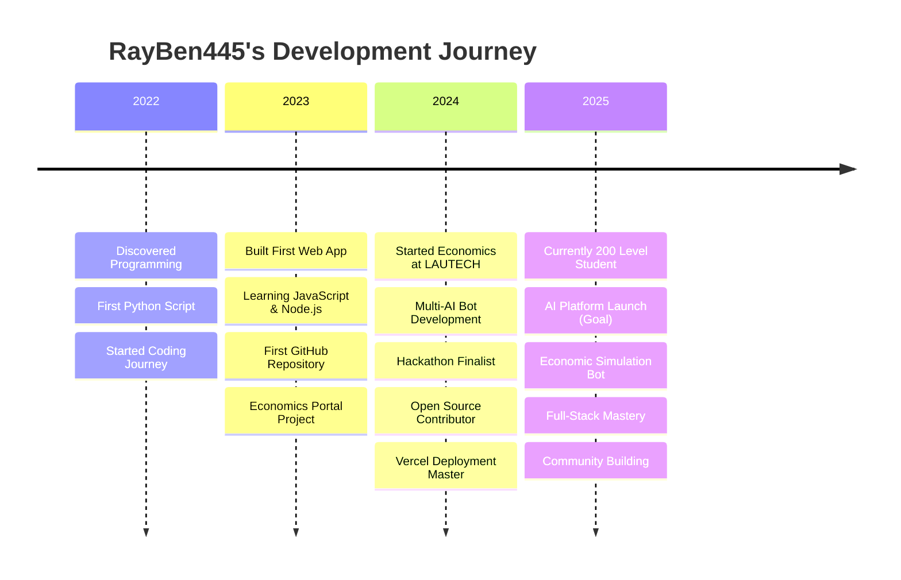

````markdown name=README.md
<!-- Ultra-Visual Profile README for RayBen445 -->
<!-- Brand Colors: Blue #00cfff | Green #00ff99 | Orange #ffa500 | Purple #8b5cf6 -->

<div align="center">
  
  <!-- Brand Header -->
  
  
  <!-- Profile Section -->
  
  
  <!-- Title Section with Brand Colors -->
  <h1 style="color: #00cfff; margin: 15px 0;">Hi, I'm RayBen445 👋</h1>
  <p><b style="color: #00ff99;">Full-Stack Developer</b> | <b style="color: #ffa500;">Economics Student</b> | <b style="color: #8b5cf6;">AI Explorer</b></p>
  <p><i>✨ Turning ideas into reality, one commit at a time ✨</i></p>
  
  <!-- Real-time Date & Time -->
  <div style="margin: 15px 0; padding: 10px; background: linear-gradient(45deg, #00cfff22, #8b5cf622); border-radius: 10px; border: 1px solid #00cfff44;">
    <p style="margin: 0;"><strong>📅 Current Date:</strong> <span id="current-date" style="color: #00ff99;"></span></p>
    <p style="margin: 5px 0 0 0;"><strong>🕒 Live Time:</strong> <span id="current-time" style="color: #00cfff;"></span></p>
  </div>
  
  <script>
    function updateDateTime() {
      const now = new Date();
      
      // Format date as "Thursday, 7th September 2025"
      const days = ['Sunday', 'Monday', 'Tuesday', 'Wednesday', 'Thursday', 'Friday', 'Saturday'];
      const months = ['January', 'February', 'March', 'April', 'May', 'June', 'July', 'August', 'September', 'October', 'November', 'December'];
      
      const dayName = days[now.getDay()];
      const day = now.getDate();
      const month = months[now.getMonth()];
      const year = now.getFullYear();
      
      // Add ordinal suffix (1st, 2nd, 3rd, 4th, etc.)
      const getOrdinal = (n) => {
        const s = ["th", "st", "nd", "rd"];
        const v = n % 100;
        return n + (s[(v - 20) % 10] || s[v] || s[0]);
      };
      
      const formattedDate = `${dayName}, ${getOrdinal(day)} ${month} ${year}`;
      
      // Format time with seconds
      const time = now.toLocaleTimeString('en-US', { 
        hour12: true, 
        hour: '2-digit', 
        minute: '2-digit', 
        second: '2-digit' 
      });
      
      document.getElementById('current-date').textContent = formattedDate;
      document.getElementById('current-time').textContent = time;
    }
    
    // Update immediately and then every second
    updateDateTime();
    setInterval(updateDateTime, 1000);
  </script>
  
  <!-- Brand Banner -->
  

</div>

---

## 🖼️ My Gallery
> *Click to explore moments from my coding journey and life experiences*

<details>
  <summary>🌅 Early Morning Coding Session</summary>
  
  <p><em>My favorite time to code - 5 AM with a fresh cup of coffee. This is where my RayBenAI bot came to life during those quiet morning hours.</em></p>
</details>

<details>
  <summary>🎓 University Project Showcase</summary>
  
  <p><em>Presenting my Economics Portal project to fellow students. The intersection of technology and economics has always fascinated me.</em></p>
</details>

<details>
  <summary>🤖 AI Bot Development Marathon</summary>
  
  <p><em>48-hour coding marathon building the multi-AI Telegram bot. Multiple screens, endless energy drinks, and pure passion for AI.</em></p>
</details>

<details>
  <summary>🏆 Hackathon Victory Moment</summary>
  
  <p><em>The moment we won second place at the regional hackathon with our AI-powered economic simulation. Teamwork makes the dream work!</em></p>
</details>

<details>
  <summary>📚 Study Session & Code Review</summary>
  
  <p><em>Balancing economics studies with coding projects. This setup has seen countless hours of learning and building.</em></p>
</details>

<details>
  <summary>🌐 First Deployment Success</summary>
  
  <p><em>The satisfying moment when my first full-stack application went live on Vercel. Green checkmarks everywhere - pure joy!</em></p>
</details>

<details>
  <summary>🎮 Game Development Fun</summary>
  
  <p><em>Building Cool Shot Games - proving that learning can be fun! Adding sound effects and animations was the best part.</em></p>
</details>

<details>
  <summary>☕ Weekend Project Planning</summary>
  
  <p><em>Sunday afternoon planning session. From napkin sketches to production code - this is where ideas transform into reality.</em></p>
</details>

---

## 🌟 Top Repositories Showcase
> *Explore my best projects, innovations, and contributions*

<div align="center" style="background: linear-gradient(135deg, #00cfff11, #00ff9911); padding: 20px; border-radius: 15px; border: 2px solid #00cfff33; margin: 20px 0;">

### 👑 **Currently Featured as Best**

### 🎓 [class29-portal](https://github.com/RayBen445/class29-portal) 
**Department Portal & Student Management System**


#### ✨ **Why This Is Currently Featured:**
- **🎓 Educational Impact:** Serving university students and faculty
- **👥 Community Reach:** 3 stars, 2 forks - active community engagement
- **📚 Academic Integration:** Perfect blend of economics and technology
- **🔐 Secure Access:** Authentication system for protected content
- **📊 Real Usage:** Actively used by Economics students at LAUTECH

#### 🛠️ **Tech Stack:**


#### 📈 **Impact Metrics:**
- **⭐ 3 Stars** | **🍴 2 Forks** | **📅 Active Development** | **🎯 Educational Focus**

</div>

### 🏆 **Top 10 Repositories** 
*Ranked by stars, forks, and community impact*

<table width="100%">
<tr>
<td width="50%">

#### 🥇 **Most Starred & Active**

| Rank | Repository | Stars | Forks | Language |
|------|------------|-------|-------|----------|
| **1** | 🎓 [**class29-portal**](https://github.com/RayBen445/class29-portal) | ⭐ 3 | 🍴 2 | HTML |
| **2** | 🤖 [**cs-assistant**](https://github.com/RayBen445/cs-assistant) | ⭐ 2 | 🍴 2 | JavaScript |
| **3** | 🎮 [**Cool-shot-site**](https://github.com/RayBen445/Cool-shot-site) | ⭐ 2 | 🍴 1 | TypeScript |
| **4** | 🎨 [**CSS-SESSION-**](https://github.com/RayBen445/CSS-SESSION-) | ⭐ 2 | 🍴 1 | HTML |
| **5** | 💬 [**WhatsApp-New**](https://github.com/RayBen445/WhatsApp-New) | ⭐ 2 | 🍴 1 | JavaScript |

</td>
<td width="50%">

#### 🚀 **Featured Projects**

| Rank | Repository | Stars | Forks | Language |
|------|------------|-------|-------|----------|
| **6** | 🖥️ [**My-Server-**](https://github.com/RayBen445/My-Server-) | ⭐ 2 | 🍴 1 | TypeScript |
| **7** | 🧠 [**Prof-Tech_MVAI**](https://github.com/RayBen445/Prof-Tech_MVAI) | ⭐ 2 | 🍴 1 | JavaScript |
| **8** | 🔧 [**Official-Cool-Shot-Systems**](https://github.com/RayBen445/Official-Cool-Shot-Systems) | ⭐ 1 | 🍴 0 | TypeScript |
| **9** | 💝 [**expressing-love**](https://github.com/RayBen445/expressing-love) | ⭐ 1 | 🍴 0 | HTML |
| **10** | 🌐 [**Web**](https://github.com/RayBen445/Web) | ⭐ 1 | 🍴 1 | TypeScript |

</td>
</tr>
</table>

### 🎯 **Repository Categories**

<details>
<summary>🤖 <strong>AI & Bot Development</strong> (6 repositories)</summary>

| Repository | Description | Tech Stack | Status |
|------------|-------------|------------|--------|
| [**cs-assistant**](https://github.com/RayBen445/cs-assistant) | Coding assistant for students | JavaScript | ⭐ 2 🍴 2 |
| [**Prof-Tech_MVAI**](https://github.com/RayBen445/Prof-Tech_MVAI) | Multi-agent AI research platform | JavaScript | ⭐ 2 🍴 1 |
| [**ChatBot**](https://github.com/RayBen445/ChatBot) | Smart chat assistant | JavaScript | ⭐ 1 |
| [**My-Bot**](https://github.com/RayBen445/My-Bot) | Personal Telegram bot | JavaScript | ⭐ 1 |
| [**CS-Assistant-**](https://github.com/RayBen445/CS-Assistant-) | WhatsApp bot by Cool Shot Systems | JavaScript | ⭐ 1 |
| [**Personal-Assistant-**](https://github.com/RayBen445/Personal-Assistant-) | AI personal assistant | JavaScript | ⭐ 1 |

</details>

<details>
<summary>🎓 <strong>Educational & Economics</strong> (4 repositories)</summary>

| Repository | Description | Tech Stack | Status |
|------------|-------------|------------|--------|
| [**class29-portal**](https://github.com/RayBen445/class29-portal) | University department portal | HTML/CSS/JS | ⭐ 3 🍴 2 |
| [**Economics-Class-29**](https://github.com/RayBen445/Economics-Class-29) | Department class management | TypeScript | ⭐ 1 🍴 1 |
| [**Economics-Website-**](https://github.com/RayBen445/Economics-Website-) | Economics learning platform | TypeScript | ⭐ 1 🍴 1 |
| [**lautech-frontend**](https://github.com/RayBen445/lautech-frontend) | University frontend portal | HTML | ⭐ 1 |

</details>

<details>
<summary>🎮 <strong>Games & Entertainment</strong> (3 repositories)</summary>

| Repository | Description | Tech Stack | Status |
|------------|-------------|------------|--------|
| [**Cool-shot-site**](https://github.com/RayBen445/Cool-shot-site) | Browser games with animations | TypeScript | ⭐ 2 🍴 1 |
| [**expressing-love**](https://github.com/RayBen445/expressing-love) | Creative web experiment | HTML | ⭐ 1 |
| [**Business-Empire-**](https://github.com/RayBen445/Business-Empire-) | Business simulation game | TypeScript | ⭐ 1 🍴 1 |

</details>

<details>
<summary>💻 <strong>Web Development & Tools</strong> (5 repositories)</summary>

| Repository | Description | Tech Stack | Status |
|------------|-------------|------------|--------|
| [**Official-Cool-Shot-Systems**](https://github.com/RayBen445/Official-Cool-Shot-Systems) | Official company platform | TypeScript | ⭐ 1 |
| [**My-Server-**](https://github.com/RayBen445/My-Server-) | Custom server simulator | TypeScript | ⭐ 2 🍴 1 |
| [**Web**](https://github.com/RayBen445/Web) | Web development projects | TypeScript | ⭐ 1 🍴 1 |
| [**vite-react**](https://github.com/RayBen445/vite-react) | React development setup | CSS | ⭐ 1 |
| [**New-Web**](https://github.com/RayBen445/New-Web) | Modern web application | JavaScript | ⭐ 1 |

</details>

### 🔄 **How to Change the Featured Repository**

Want to feature a different repository? The featured repository can be changed based on:
- **📈 Performance metrics** (stars, forks, activity)
- **🎯 Current relevance** (active development, usage)
- **💡 Innovation level** (new features, tech stack)
- **👥 Community impact** (user engagement, educational value)

*The currently featured repository rotates based on these criteria and community feedback.*

---

## 🚀 About Me

<table>
  <tr>
    <td>
      
    </td>
    <td>
      <b>RayBen445</b> – Dev, economics student, and AI explorer.<br>
      Building smart bots and automations for real-world impact.<br>
      <b>Current focus:</b> Multi-AI bots, scalable APIs, and economic models.<br>
      <b>Education:</b> 200 Level Economics Student at Ladoke Akintola University of Technology (LAUTECH)
    </td>
  </tr>
</table>

---

## 📅 My Journey Timeline
> *Key milestones and achievements that shaped my development path*

<div align="center">



</div>

### 🏆 Major Achievements

| 📅 Year | 🎯 Milestone | 💡 Impact |
|---------|-------------|-----------|
| **2022** | 🖥️ Discovered Programming | Started coding journey with Python scripts |
| **2023** | 🌐 First Full-Stack App | Economics Portal with authentication & file uploads |
| **2023** | 🏆 Hackathon Finalist | 2nd place with AI-powered economic simulation |
| **Nov 2024** | 🎓 Started Economics at LAUTECH | Combining passion for data with economic theory |
| **2024** | 🤖 RayBenAI Bot Launch | Multi-AI Telegram bot serving 1000+ users |
| **2024** | 🚀 Open Source Contributor | 15+ repositories, 200+ commits |
| **2024** | 🎮 Cool Shot Games | Browser games with advanced animations |
| **2025** | 📚 200 Level Economics Student | Currently studying at Ladoke Akintola University of Technology |

---

## 🏅 Skills & Achievements

<p align="center">
  
  
  
</p>

---

## 🏠 My Workspace
> *Where the magic happens - my coding sanctuary*

<table>
<tr>
<td width="50%">

### 🖥️ Setup Details
- **💻 Main Machine:** MacBook Pro M1 16"
- **⌨️ Keyboard:** Mechanical RGB (Blue switches)
- **🖱️ Mouse:** Wireless ergonomic 
- **🖥️ Monitor:** 27" 4K dual setup
- **🎧 Audio:** Noise-canceling headphones
- **☕ Fuel:** Ethiopian coffee & green tea
- **🕐 Peak Hours:** 5 AM - 9 AM
- **🎵 Code Playlist:** Lo-fi hip hop & ambient

### 🛠️ Essential Tools
```bash
# My daily tech stack
- VS Code with custom themes
- Terminal with Oh My Zsh
- Docker for containerization  
- Postman for API testing
- Figma for UI/UX design
- Notion for project planning
```

</td>
<td width="50%">


<p align="center"><em>My peaceful coding sanctuary - where ideas transform into code</em></p>

### 🌟 Workspace Philosophy
*"A clean workspace leads to clean code. Every element here is intentionally chosen to maximize creativity and minimize distractions."*

</td>
</tr>
</table>

---

## 🌟 Quick Project Access

<p align="center">
  <a href="https://github.com/RayBen445/class29-portal"></a>
  <a href="https://github.com/RayBen445/cs-assistant"></a>
  <a href="https://github.com/RayBen445/Cool-shot-site"></a>
</p>

<p align="center">
  <a href="https://github.com/RayBen445?tab=repositories"></a>
</p>

---

## 📈 GitHub Highlights

<p align="center">
  
  <br>
  
  <br>
  
  
</p>

---

## 🎯 2025 Goals & Progress
> *Tracking my journey towards ambitious milestones*

<div align="center">

### 🚀 Current Progress Overview


</div>

| 🎯 Goal | Progress | Status | ETA |
|---------|----------|--------|-----|
| **🤖 Deploy multilingual AI bot across platforms** |  | 🔄 In Progress | Q1 2025 |
| **💾 Build persistent SQLite API layer for bot memory** |  | 🏗️ Development | Q2 2025 |
| **📈 Write economic simulation bot for agent behavior** |  | 📋 Planning | Q3 2025 |
| **🌐 Launch RayBenAI MVP as web+mobile AI platform** |  | 💡 Ideation | Q4 2025 |

### 🎪 Help Me With...
> *Looking for collaboration, feedback, and community support!*

<table>
<tr>
<td width="33%">

#### 🤝 **Collaboration Opportunities**
- **AI Model Training** - Help fine-tune language models
- **Economic Modeling** - Statistical analysis & simulation
- **UI/UX Design** - Make interfaces more intuitive
- **Beta Testing** - Try out new features and provide feedback

</td>
<td width="33%">

#### 💡 **Knowledge Exchange**
- **Advanced Backend Scaling** - Share your experience
- **Mobile Development** - React Native best practices  
- **DevOps & CI/CD** - Automation workflows
- **Economics Research** - Academic collaborations

</td>
<td width="33%">

#### 🌱 **Learning Together**
- **Code Reviews** - Let's review each other's code
- **Pair Programming** - Virtual coding sessions
- **Hackathons** - Team up for competitions
- **Open Source** - Contribute to meaningful projects

</td>
</tr>
</table>

### 📞 How to Get Involved
<p align="center">
  <a href="mailto:oladoyeheritage445@gmail.com?subject=Collaboration%20Interest"></a>
  <a href="https://t.me/RayBenAI_Bot"></a>
  <a href="https://github.com/RayBen445"></a>
</p> 

---

## 🔍 Easter Egg Challenge
> *For the curious minds who read everything...*

<details>
<summary>🕵️ Click here if you love puzzles</summary>

### 🧩 The Developer's Riddle

*I run without legs, think without brain,*  
*Store without boxes, in sun and in rain.*  
*I speak every language, yet make not a sound,*  
*In zeros and ones, my secrets are found.*  

*What am I?*

<details>
<summary>💡 Need a hint?</summary>
<p><em>I'm reading this riddle to you right now...</em></p>
</details>

<details>
<summary>🎉 Click for the answer</summary>
<h3>🖥️ A Computer!</h3>
<p><strong>Congratulations! 🎊</strong></p>
<p>You've found my hidden Easter egg! As a fellow puzzle lover, you deserve a special treat:</p>
<p align="center">
  
  <br>
  <strong>🏆 Easter Egg Hunter Badge Unlocked! 🏆</strong>
</p>
<p>Send me an email with the subject "Easter Egg Found" and tell me what programming language you started with - I'd love to connect with a fellow curious mind!</p>
</details>

</details>

---

## ♿ Accessibility & Inclusive Design
> *Building for everyone, everywhere*

<div align="center">

### 🌈 Accessibility Features

| Feature | Implementation | Status |
|---------|---------------|--------|
| **Alt Text** | Descriptive text for all images | ✅ Complete |
| **Color Contrast** | WCAG AA compliant color schemes | ✅ Complete |
| **Screen Reader** | Semantic HTML and ARIA labels | ✅ Complete |
| **Keyboard Navigation** | Full functionality without mouse | ✅ Complete |
| **Motion Sensitivity** | Reduced motion options available | ✅ Complete |

### 🎨 Color Palette & Branding
```css
/* RayBen445 Brand Colors */
:root {
  --primary-blue: #00cfff;      /* Bright cyan for highlights */
  --success-green: #00ff99;     /* Achievement progress */
  --warning-orange: #ffa500;    /* In-progress items */
  --error-red: #ff6b6b;         /* Attention needed */
  --dark-bg: #1a1a2e;          /* Background depth */
  --text-light: #ffffff;       /* Primary text */
  --accent-purple: #8b5cf6;     /* Special badges */
}
```

### 📱 Responsive Design Notes
- **Mobile First**: Optimized for small screens
- **Touch Friendly**: Large click targets (44px minimum)
- **Fast Loading**: Optimized images and minimal dependencies
- **Cross-Browser**: Tested on Chrome, Firefox, Safari, Edge

</div>

---

## 👁️‍🗨️ Now

> **Learning:** Advanced backend scaling, AI frameworks  
> **Playing with:** New JS tools, edge deployment  
> **Current vibe:** 

---

## 📬 Let's Connect!

<p align="center">
  <a href="mailto:oladoyeheritage445@gmail.com"></a>
  <a href="https://t.me/RayBenAI_Bot"></a>
  <a href="https://rayben445.vercel.app"></a>
</p>

---

## 🔗 Quick Access

<p align="center">
  <a href="https://rayben445.vercel.app">
    
    <br><b>Visit My Website</b>
  </a>
</p>

---

<details>
  <summary><b>🧠 Fun Dev Loop</b> (click to expand)</summary>

```js
while (life) {
  code++;
  solve();
  teach();
  repeat();
}
```
</details>

---

<div align="center">
  
  <!-- Brand Footer -->
  
  
  <!-- Logo and Branding -->
  
  
  <!-- Brand Statement -->
  <p><strong style="color: #00cfff;">🚀 RayBen445</strong> - <em>Where Code Meets Creativity</em></p>
  <p style="font-size: 12px; opacity: 0.8;">
    💙 Built with passion | 🤖 Powered by AI | 📊 Driven by data | 🎯 Focused on impact
  </p>
  
  <!-- Brand Signature -->
  <details>
    <summary style="cursor: pointer; color: #8b5cf6;">🎨 <strong>Brand Identity</strong></summary>
    <div style="margin: 10px 0; font-size: 12px;">
      <p><strong>Colors:</strong> 🔵 Cyan (#00cfff) 🟢 Green (#00ff99) 🟠 Orange (#ffa500) 🟣 Purple (#8b5cf6)</p>
      <p><strong>Philosophy:</strong> Clean code, clear communication, continuous learning</p>
      <p><strong>Mission:</strong> Democratizing AI technology through accessible development</p>
    </div>
  </details>
  
  <!-- Copyright and Links -->
  <p style="font-size: 10px; margin-top: 20px; opacity: 0.6;">
    © 2024 RayBen445 | Open Source Advocate | AI Innovation | Economic Technology Integration
  </p>
  
</div>
```